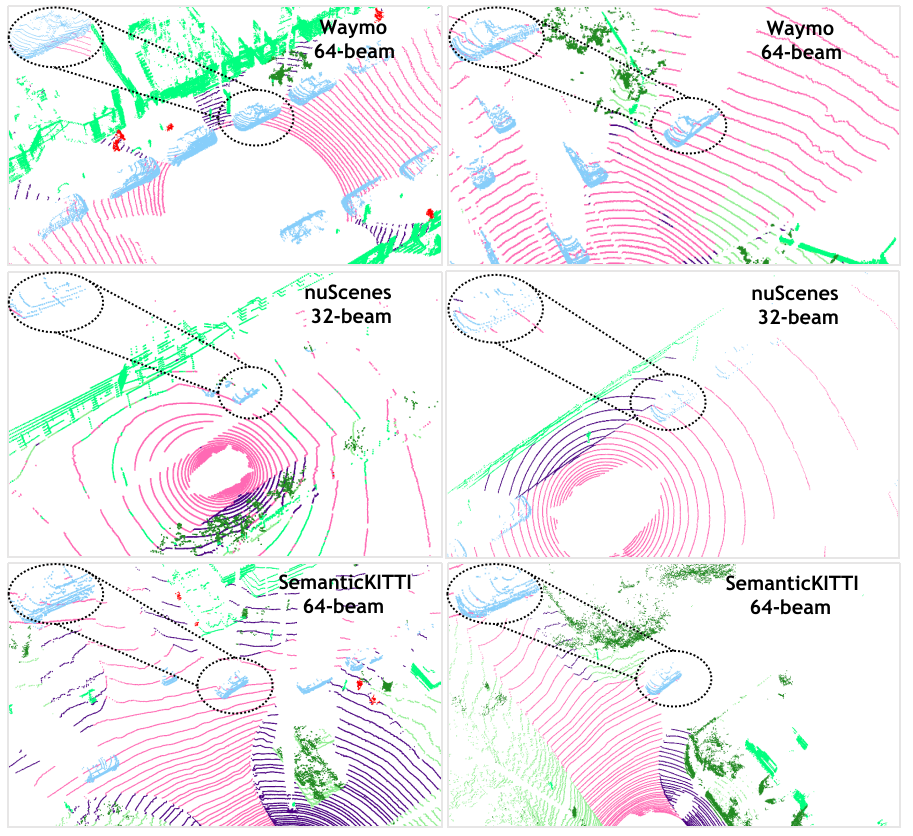
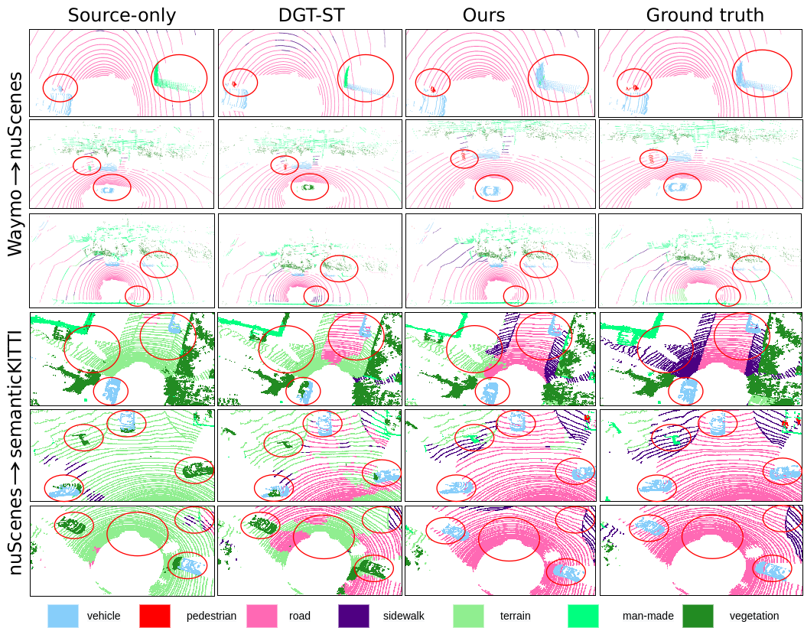

> ---
>
> # SADA-3D: Structure-Aware Domain Adaptation for 3D Point Cloud Semantic Segmentation
>
> 🚧 **This repository contains the official implementation of our recent work on structure-aware domain adaptation for 3D point cloud semantic segmentation.**
> 📌 The paper proposes a novel framework named **SADA-3D**, which incorporates structural information and point-level domain alignment to improve 3D semantic segmentation performance under domain shift.
>
> ## 🔒 Notice
>
> Our paper is currently under review. To comply with anonymous review policy, **the full code and detailed method will be released publicly upon acceptance**.
>
> Please stay tuned for further updates.
>
> ## 📄 Paper Information
>
> > **Title**: *SADA-3D: Structure-Aware Unsupervised Domain Adaptive Segmentation of 3D Point Clouds*
> > **Authors**: Shengjie Huang\*, Si Zuo\*, Qi Wu, Yougang Bian, Xiaohui Qin†, Luoxing Li
> > (*Equal contribution, †Corresponding author*)
>
> ## 📊 Domain Shift Illustration
>
> 

>   
> 

>
> *Figure: Differences in point cloud distributions across datasets. Waymo and SemanticKITTI use 64-beam LiDARs with denser coverage, while nuScenes uses 32-beam LiDAR resulting in sparser point clouds.*
>
> ## 🧪 Results
>
> 

>   
> 

>
> *Figure: Qualitative results comparing source-only, our method (SADA-3D), and ground truth labels on nuScenes→SemanticKITTI and Waymo→nuScenes scenarios. Red circles highlight improved segmentation.*
>
> ## 
>
> ## 🔗 Citation & Code Release
>
> The citation and code will be made available upon paper acceptance. Thank you for your interest!
>
